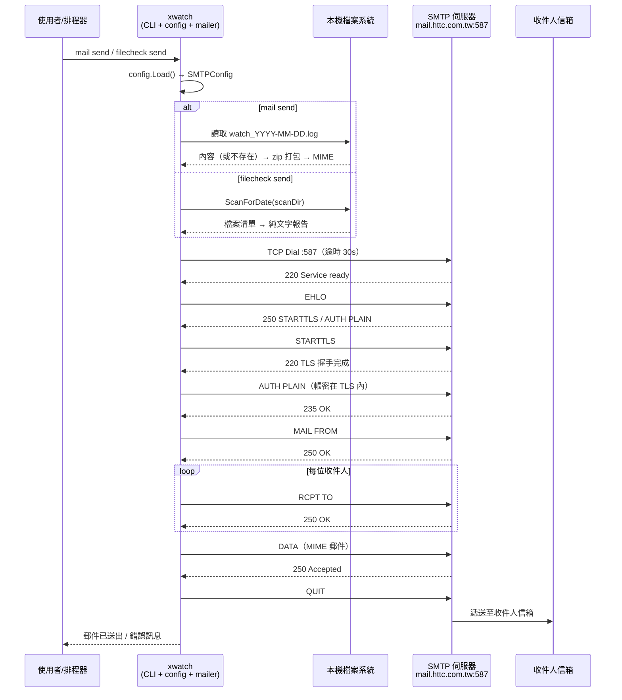

# xwatch SMTP 寄件流程圖（精簡版）

```mermaid
sequenceDiagram
    participant U  as 使用者/排程器
    participant X  as xwatch<br/>(CLI + config + mailer)
    participant FS as 本機檔案系統
    participant S  as SMTP 伺服器<br/>mail.httc.com.tw:587
    participant R  as 收件人信箱

    U->>X: mail send / filecheck send
    X->>X: config.Load() → SMTPConfig

    alt mail send
        X->>FS: 讀取 watch_YYYY-MM-DD.log
        FS-->>X: 內容（或不存在）→ zip 打包 → MIME
    else filecheck send
        X->>FS: ScanForDate(scanDir)
        FS-->>X: 檔案清單 → 純文字報告
    end

    X->>S: TCP Dial :587（逾時 30s）
    S-->>X: 220 Service ready
    X->>S: EHLO
    S-->>X: 250 STARTTLS / AUTH PLAIN
    X->>S: STARTTLS
    S-->>X: 220 TLS 握手完成
    X->>S: AUTH PLAIN（帳密在 TLS 內）
    S-->>X: 235 OK

    X->>S: MAIL FROM
    S-->>X: 250 OK
    loop 每位收件人
        X->>S: RCPT TO
        S-->>X: 250 OK
    end
    X->>S: DATA（MIME 郵件）
    S-->>X: 250 Accepted
    X->>S: QUIT

    S->>R: 遞送至收件人信箱
    X-->>U: 郵件已送出 / 錯誤訊息
```
