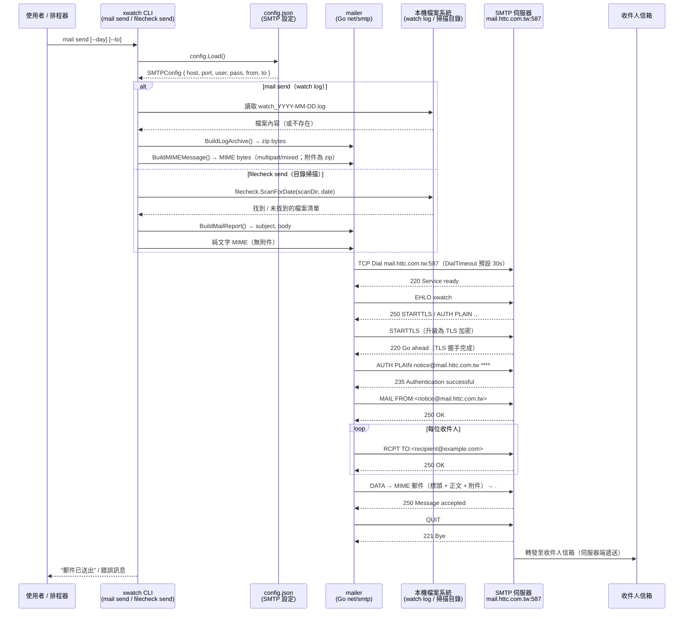

# xwatch SMTP 寄件流程說明

## 一、SMTP 定義與基本原理

### SMTP 是什麼

SMTP（Simple Mail Transfer Protocol，簡單郵件傳輸協定）是網際網路上用於
**「寄出」電子郵件**的標準協定，定義於 RFC 5321。

SMTP 只負責「傳送」，不負責「收信」。
收信由另外的協定負責：POP3（RFC 1939）或 IMAP（RFC 9051）。

```
您的程式 ──SMTP──► 郵件伺服器 ──SMTP──► 對方郵件伺服器 ──IMAP/POP3──► 收件人
```

### 歷史與版本

| 年份 | 事件 |
|------|------|
| 1982 | RFC 821：SMTP 定義，明文、無驗證 |
| 1995 | RFC 1869：ESMTP（Extended SMTP），加入 EHLO 指令與擴充機制 |
| 1999 | RFC 2554：加入 AUTH 指令，支援帳號密碼驗證 |
| 2002 | RFC 3207：STARTTLS 擴充，允許在明文連線上升級為 TLS 加密 |
| 2008 | RFC 5321：現行 SMTP 標準，整合上述所有擴充 |

---

## 二、常用連接埠對照

| 連接埠 | 名稱       | 加密方式           | 說明 |
|--------|------------|--------------------|------|
| 25     | SMTP       | 無（可 STARTTLS）  | 伺服器對伺服器轉發；大部分 ISP 封鎖 |
| 465    | SMTPS      | SSL/TLS（一開始）  | 舊標準，現已不建議 |
| **587**| Submission | **STARTTLS**       | 客戶端寄信的現代標準（本專案使用） |

本專案設定：`mail.httc.com.tw:587`，使用 STARTTLS 升級加密。

---

## 三、SMTP 對話流程（逐步說明）

### 連線與交握

```
client → server : TCP 連線至 mail.httc.com.tw:587
server → client : 220 mail.httc.com.tw Service ready
client → server : EHLO xwatch              ← 自我介紹（Extended Hello）
server → client : 250-mail.httc.com.tw
                  250-SIZE 52428800
                  250-STARTTLS              ← 告知支援的擴充功能
                  250 AUTH LOGIN PLAIN
```

### STARTTLS 加密升級（Port 587 的關鍵步驟）

```
client → server : STARTTLS
server → client : 220 Go ahead
                  ↓ TLS 握手（交換憑證、協商加密套件）
                  ↓ 之後所有通訊均為 TLS 加密
client → server : EHLO xwatch              ← TLS 後需重新 EHLO
server → client : 250 AUTH LOGIN PLAIN     ← 重新宣告可用擴充
```

> [STARTTLS 說明]
> Port 587 一開始建立的是**明文 TCP 連線**，然後透過 STARTTLS 指令在同一個
> 連線上「升級」為 TLS 加密。與 Port 465 不同（465 一開始就是 SSL/TLS）。

### 身份驗證（AUTH PLAIN）

```
client → server : AUTH PLAIN <Base64("\0username\0password")>
server → client : 235 2.7.0 Authentication successful
```

本專案使用 `smtp.PlainAuth`，將帳號密碼編碼為 Base64 傳送。
在 STARTTLS 加密後傳送，不會明文洩漏。

### 郵件投遞

```
client → server : MAIL FROM:<notice@mail.httc.com.tw>
server → client : 250 OK

client → server : RCPT TO:<recipient@example.com>   ← 每位收件人一次
server → client : 250 OK

client → server : DATA
server → client : 354 Start input; end with <CRLF>.<CRLF>

client → server : From: notice@mail.httc.com.tw
                  To: recipient@example.com
                  Subject: ...
                  MIME-Version: 1.0
                  Content-Type: multipart/mixed; boundary="..."
                  
                  --boundary
                  Content-Type: text/plain; charset=UTF-8
                  
                  郵件正文...
                  
                  --boundary
                  Content-Type: application/zip
                  Content-Disposition: attachment; filename="watch_2026-03-04.zip"
                  Content-Transfer-Encoding: base64
                  
                  UEsDB...（zip 的 Base64）
                  --boundary--
                  .                          ← 結束標記

server → client : 250 2.0.0 Message accepted

client → server : QUIT
server → client : 221 2.0.0 Bye
```

---

## 四、xwatch 寄件流程圖（Mermaid）



---

## 五、xwatch 中對應的 Go 程式碼位置

| 步驟 | 對應程式碼 |
|------|-----------|
| 載入 SMTP 設定 | `internal/config/config.go` → `MailSettings` |
| mail 指令入口 | `internal/mailcmd/mailcmd.go` → `send()` |
| filecheck 指令入口 | `internal/filecheckcmd/filecheckcmd.go` → `mailSend()` |
| 建立 zip 附件 | `internal/mailer/mailer.go` → `BuildLogArchive()` |
| 組裝 MIME 訊息 | `internal/mailer/mailer.go` → `BuildMIMEMessage()` |
| TCP 連線 + STARTTLS | `internal/mailer/mailer.go` → `dialAndSend()` |
| AUTH PLAIN | Go 標準函式庫 `net/smtp.PlainAuth` |
| MAIL FROM / RCPT TO / DATA | Go 標準函式庫 `net/smtp.Client` |
| 寄信失敗寫入 mail log | `internal/mailcmd/mailcmd.go` → `writeMailLog()` |

---

## 六、常見錯誤與原因

| 錯誤訊息 | 可能原因 |
|----------|----------|
| `SMTP 連線失敗（逾時=30s）` | 防火牆封鎖 Port 587；網路不通 |
| `STARTTLS 失敗` | 伺服器憑證問題；伺服器不支援 STARTTLS |
| `SMTP 認證失敗` | 帳號或密碼錯誤 |
| `MAIL FROM 失敗` | 寄件者地址格式錯誤或未被允許 |
| `RCPT TO xxx 失敗` | 收件人地址格式錯誤（如 ADDR[...] 佔位符）；收件人不存在 |
| `501 5.1.3 Bad recipient address syntax` | 收件人地址含有非法字元（如 `ADDR[r021@httc.com.tw]`） |

---

## 七、安全性說明

1. **STARTTLS**：本專案使用 Port 587 + STARTTLS，確保帳號密碼與郵件內容在
   傳輸過程中均以 TLS 加密，不會明文暴露。

2. **AUTH PLAIN**：帳號密碼以 Base64 編碼傳送（非加密），因此**必須**搭配
   STARTTLS 或 TLS 才安全。本專案在 STARTTLS 完成後才進行驗證，符合安全規範。

3. **密碼儲存**：`config.json` 中的 SMTP 密碼在 Windows 上透過 DPAPI 加密存放
   （`internal/crypto/dpapi_windows.go`），避免明文儲存。
